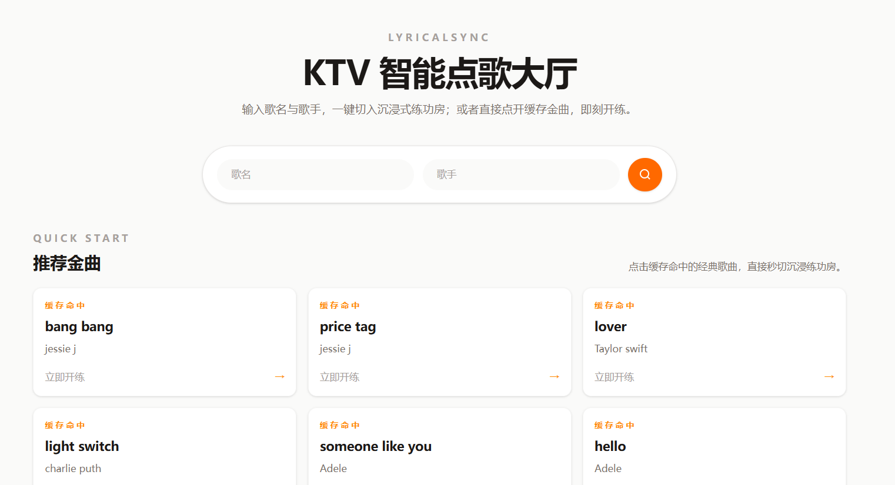
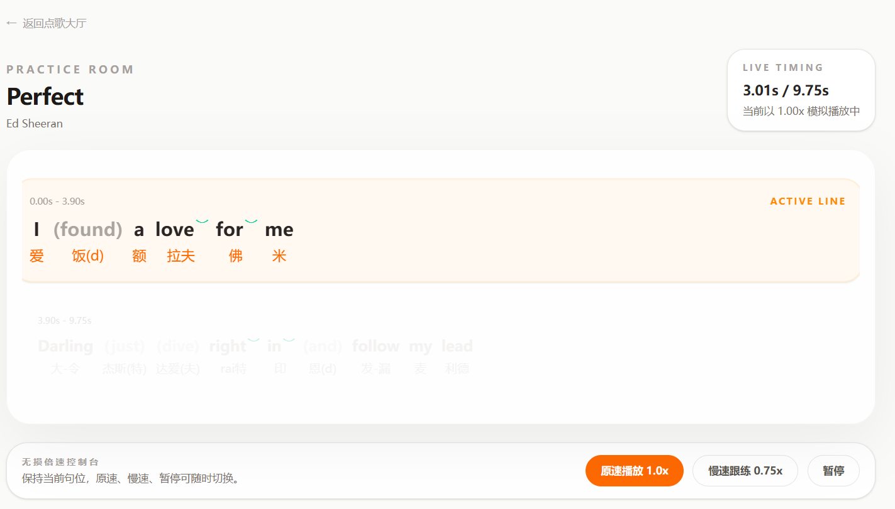
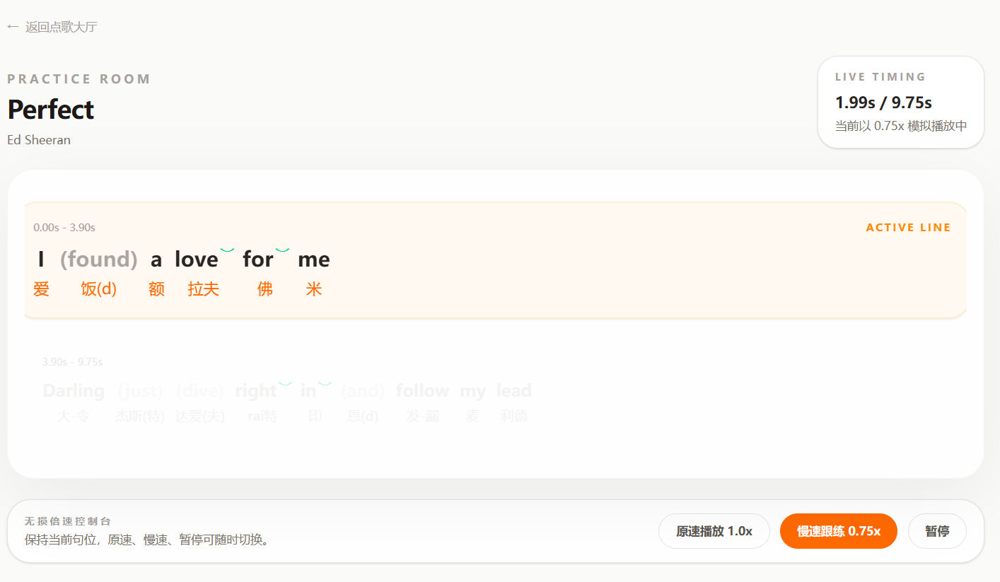

# LyricalSync（字里行间 · 发声练功房）

> **An AI-powered English pronunciation trainer for Chinese-speaking learners.**
> A full-stack demo project that helps learners practice singing English songs with word-level phonetic hints, liaison and elision markers, and a time-synced practice room.

一个面向中文学习者的 AI 英文歌词发音可视化练习应用。输入歌曲和歌手，后端自动获取歌词并调用 LLM 逐词生成中文谐音、连读（liaison）与弱读（elision）标记，前端按时间轴高亮展示当前行，支持 1.0x 原速与 0.75x 慢速跟练。

---

## 界面展示

### 首页 · KTV 智能点歌大厅



### 练习页 · 1.0x 原速跟练



### 练习页 · 0.75x 慢速跟练



---

## 核心用户流程

1. 用户在首页输入**歌名 + 歌手**，或点击"推荐金曲"中已缓存的歌曲
2. 后端先查**本地 SQLite 缓存**；未命中则从外部歌词接口获取歌词
3. 调用 DeepSeek LLM（OpenAI 兼容接口）**逐词生成中文谐音、连读/弱读等标注**
4. 结果写入缓存，前端跳转到**练习页（Practice Room）**
5. 练习页按时间轴高亮当前行，每词下方显示中文谐音，连读用弧线 ︶ 标记、弱读用括号 + 透明度标记
6. 支持 **1.0x 原速**与 **0.75x 慢速**跟练，可随时暂停

---

## 技术架构

| 层 | 技术栈 |
|---|---|
| 前端 | Vue 3 · TypeScript · Vite · Tailwind CSS |
| 后端 | Go 1.25 · Gin · GORM |
| 数据 | SQLite（本地缓存） |
| AI 集成 | DeepSeek Chat（OpenAI 兼容协议，通过 `github.com/sashabaranov/go-openai` 调用） |
| 歌词数据来源 | 可配置的外部歌词 API（默认指向 `https://music.163.com/api`，由 `LYRICS_API_BASE_URL` 环境变量决定） |

```
┌──────────┐   HTTP    ┌──────────────────────────────────────┐
│  浏览器   │ ────────> │  前端 Vue 3 (Vite + TS + Tailwind)   │
│ (用户)    │ <──────── │  App.vue / LyricPlayer.vue           │
└──────────┘           └─────────────┬────────────────────────┘
                                    │ /api/songs/*
                                    ▼
                    ┌──────────────────────────────────────┐
                    │  Go 后端 (Gin + GORM + SQLite)         │
                    │  main.go                                │
                    │   ├─ services/lyric_service.go         │
                    │   │     └─ 歌词搜索 + 获取 + 清洗      │
                    │   ├─ services/ai_service.go            │
                    │   │     └─ 分块 → DeepSeek LLM → 解析  │
                    │   │     └─ 7 种错误分类 + 退避重试      │
                    │   └─ database/ (GORM + SQLite)        │
                    │        └─ Song 表 (缓存)               │
                    └─────────────┬──────────┬───────────────┘
                                  │          │
                                  ▼          ▼
                          ┌──────────┐  ┌──────────────┐
                          │ DeepSeek │  │ 外部歌词 API │
                          │ Chat API │  │ (可配置 URL) │
                          └──────────┘  └──────────────┘
```

---

## 本地运行步骤

### 前置条件

- Go 1.25+
- Node.js `^20.19.0 || >=22.12.0`
  - 该范围来自 Vite 8 的 engines 声明；当前本地使用 Node.js v22.22.2，已通过 `npm run build`。
- 一个 DeepSeek（或其他 OpenAI 兼容）API Key

### 1. 克隆仓库

```bash
git clone <repository-url>
cd lyrical-sync
```

### 2. 配置后端环境变量

```bash
cd backend
cp .env.example .env
# 用编辑器打开 .env，填入你自己的 OPENAI_API_KEY
```

`backend/.env.example` 中列出了 4 个变量（`OPENAI_API_KEY`、`MODEL_NAME`、`API_BASE_URL`、`LYRICS_API_BASE_URL`），均带安全示例值，**不会泄露任何真实凭据**。

### 3. 启动后端

```bash
go mod tidy
go run .
```

后端默认监听 `http://localhost:8080`。

### 4. 启动前端

```bash
cd ../frontend
npm install
npm run dev
```

前端默认访问 `http://localhost:5173`。

### 5. 验证

```bash
# 检查后端搜索接口
curl http://localhost:8080/api/songs/search
```

浏览器打开 `http://localhost:5173`，输入歌名与歌手即可开始使用。

> **注意**：如果你没有有效的 API Key，后端可以启动但 AI 标注功能不可用；"推荐金曲"区域需要先有一首歌被成功加载才会显示。

---

## API 概览

| 方法 | 路径 | 说明 |
|------|------|------|
| `POST` | `/api/song/parse` | 输入歌词文本，调用 LLM 生成逐词发音标注 |
| `POST` | `/api/songs/admin/add` | 手动添加歌曲（标题 + 歌手 + 原始歌词） |
| `POST` | `/api/songs/load` | 按标题 + 歌手加载歌曲（缓存优先 → 获取歌词 → LLM 标注） |
| `GET`  | `/api/songs/search` | 按关键词 / 标题 / 歌手搜索本地缓存歌曲库 |
| `GET`  | `/api/songs/:id` | 获取歌曲详情（含发音标注数据） |

> **CORS 说明：** 开发环境下，后端会将请求的 `Origin` 原样写入 `Access-Control-Allow-Origin`，未设置固定白名单，也未启用 `Access-Control-Allow-Credentials`。该配置便于本地前后端联调；若部署到公网，应改为显式的 Origin 白名单。

> **CORS note:** In development, the backend reflects the request `Origin` in `Access-Control-Allow-Origin`. It does not use a fixed allowlist and does not enable `Access-Control-Allow-Credentials`. This is convenient for local frontend-backend integration; public deployments should use an explicit Origin allowlist.

---

## 已知限制

- **没有用户系统**：当前不支持注册 / 登录，所有用户匿名使用，歌曲缓存对所有用户共享。
- **LLM 标注为辅助结果**：发音标注由 LLM 生成，不代表绝对发音正确性，适用于辅助学习而非权威参考。
- **歌词数据来源需自行确认**：默认使用网易云音乐公开接口获取歌词，该接口可能受限于服务可用性和使用条款，建议仅用于个人学习。
- **测试覆盖有限**：当前仅包含 `splitLyricsIntoChunks`（歌词分块策略）的单元测试，其余模块暂未覆盖。
- **无真实音频播放**：前端使用基于 `requestAnimationFrame` 的模拟播放（按词数估算时间轴），不支持真实音频同步。
- **以本地运行和作品展示为主**：本项目主要用于学习与作品集展示，未做生产级部署优化。

---

## 目录结构

```text
lyrical-sync/
├── backend/
│   ├── .env.example          # 环境变量模板（不含真实凭据）
│   ├── go.mod
│   ├── main.go               # Gin 路由 + 错误映射
│   ├── database/
│   │   ├── db.go             # SQLite 初始化 + AutoMigrate
│   │   └── song.go           # GORM 模型
│   └── services/
│       ├── ai_service.go     # LLM prompt / 分块 / 重试 / 错误分类
│       ├── ai_service_test.go # 分块策略单元测试
│       └── lyric_service.go  # 歌词获取与清洗
├── frontend/
│   ├── src/
│   │   ├── App.vue           # 首页点歌大厅 + 播放页
│   │   ├── components/
│   │   │   └── LyricPlayer.vue # 练功房（模拟播放 + 可视化）
│   │   └── types/song.ts     # 前端类型定义
│   └── package.json
├── docs/
│   └── images/               # README 截图素材
└── README.md
```

---

## 构建

```bash
# 后端
cd backend && go build -o lyrical-sync-backend .

# 前端
cd frontend && npm run build
```

---

## License

MIT